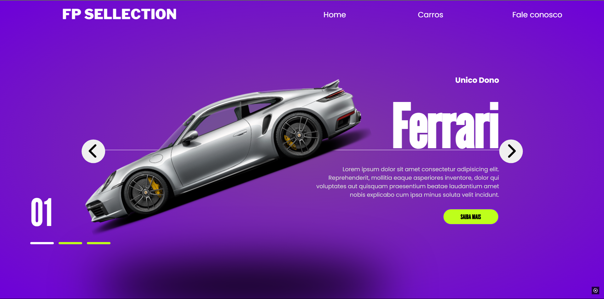

# 🚗 FP Selection

Projeto de site responsivo criado para exibir carros de luxo com visual moderno e interativo. Desenvolvido com HTML, CSS e JavaScript puros, com foco em design e experiência do usuário.

---

## 🎥 Demonstração

---

## 📸 Sobre o Projeto

O *FP Selection* é uma vitrine de carros premium com navegação em carrossel, design chamativo e responsivo, ideal para portfólios ou landing pages de veículos.

### 💡 Funcionalidades:

- Carrossel de carros com transições
- Destaques como nome, descrição e botão de ação
- Design responsivo para diferentes telas
- Botões de navegação intuitivos

---

## 🛠 Tecnologias utilizadas

- HTML5
- CSS3 (com gradientes, animações e responsividade)
- JavaScript (para a lógica de navegação entre slides)

---

## # 🚗 FP Selection

Projeto de site responsivo criado para exibir carros de luxo com visual moderno e interativo. Desenvolvido com HTML, CSS e JavaScript puros, com foco em design e experiência do usuário.

---

## 📸 Sobre o Projeto

O **FP Selection** é uma vitrine de carros premium com navegação em carrossel, design chamativo e responsivo, ideal para portfólios ou landing pages de veículos.

### 💡 Funcionalidades:

- Carrossel de carros com transições
- Destaques como nome, descrição e botão de ação
- Design responsivo para diferentes telas
- Botões de navegação intuitivos

---

## 🛠 Tecnologias utilizadas

- HTML5
- CSS3 (com gradientes, animações e responsividade)
- JavaScript (para a lógica de navegação entre slides)

---

## 📫 Contato

- GitHub: [@pedrohg3](https://github.com/pedrohg3)
- Numero (+351) 939549074

